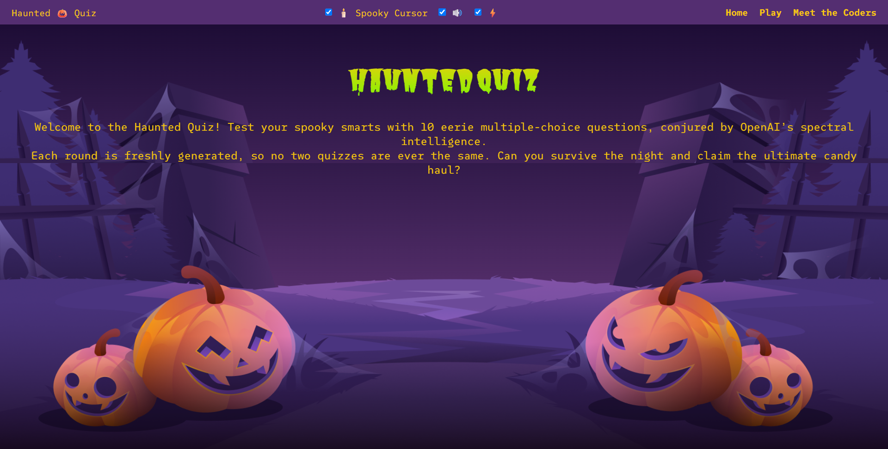
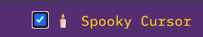

# 🎃 Haunted Quiz

A spooky Halloween-themed quiz application that generates unique trivia questions using OpenAI's API. Built for the "Hack or Treat" hackathon.



## 🌟 Features

### Core Functionality
- **AI-Generated Questions** - 10 unique Halloween trivia questions generated via OpenAI GPT-4o-mini
- **Single Page Application (SPA)** - Smooth navigation between Home, Quiz, Results, and Meet the Team sections
- **Timer System** - 120-second countdown with visual warnings at 10 seconds remaining
- **Live Score Tracking** - Real-time score updates during gameplay
- **Smart Answer Feedback** - Correct answers highlighted in green, incorrect in orange with correct answer revealed

### Spooky Effects 🎭
- **Atmospheric Thunder** - Random thunder sounds (10-20 second intervals) with lightning flashes
- **Lightning Overlay** - Dynamic screen flashes synchronized with thunder
- **Spooky Cursor Trail** - Optional glowing wisp/bat trail that follows mouse movement
- **Question Transitions** - Smooth smoke-like fade in/out animations between questions
- **Sound Effects** - Click, correct answer, wrong answer, and victory sounds

### Accessibility & UX
- **Toggle Controls** - User can enable/disable SFX, lightning flashes, and cursor effects

- **Reduced Motion Support** - Respects `prefers-reduced-motion` for accessibility

- **Mobile Responsive** - Hamburger menu and touch-optimized controls

- **Fine Pointer Detection** - Cursor effects only on devices with precise pointing (no touch)

### Visual Design
<!-- TODO: Add more visuals, wireframes and UI workflow -->
- **Halloween Theme** - Purple, orange, green, and yellow color scheme
- **Decorative Graphics** - Spooky background images (pumpkins, haunted scenery)
- **Custom Fonts** - "Butcherman" for headings, "SUSE Mono" for body text
- **Gradient Text** - Yellow-to-green gradient on main headings

## 🏗️ Project Structure

```
/haunted-quiz/
├── api/
│   └── generate-question.js    # Serverless function (OpenAI proxy)
├── sfx/                         # Sound effects folder
│   ├── click.mp3.wav
│   ├── correct.mp3.wav
│   ├── wrong.mp3.mp3
│   ├── victory.mp3.wav
│   ├── thunder1.mp3.wav
│   └── thunder2.mp3.aiff
├── index.html                   # Main HTML (SPA structure)
├── style.css                    # Styles with animations
├── script.js                    # Core application logic
└── generate-question.json       # Mock data for local testing
```

## ⚙️ JavaScript Functionality

### Global State Management
```javascript
let questions = [];        // Array of 10 question objects
let currentIndex = 0;      // Current question index (0-9)
let score = 0;             // Player's score
let totalQuestions = 10;   // Total questions per game
let timeLeft = 120;        // Timer in seconds
let timerInterval = null;  // Timer reference
```

### Key Functions

#### `loadQuestions()`
- Fetches questions from mock JSON (testing) or serverless API (production)
- Handles errors gracefully with try-catch
- Updates `totalQuestions` based on response length

#### `startQuiz()`
- Initializes audio system on first user interaction
- Resets score and question index
- Loads questions and starts timer
- Triggers entrance animations
- Begins atmospheric thunder effects

#### `renderQuestion(q)`
- Dynamically generates question HTML with answer buttons
- Escapes HTML to prevent XSS attacks
- Uses inline `onclick` handlers for answer checking

#### `checkAnswer(selectedIndex)`
- Compares selected answer with correct answer
- Supports both `correctIndex` (number) and `answer` (string) formats
- Updates score and displays visual feedback
- Plays appropriate sound effect
- Advances to next question after 800ms delay

#### `advanceQuiz()`
- Handles question transition animations
- Checks if more questions remain
- Calls `endQuiz()` when all questions answered

#### `endQuiz()`
- Clears timer and stops atmospheric effects
- Calculates performance message based on score
- Plays victory sound
- Navigates to results page

### Audio System
```javascript
audio = {
  enabled: () => boolean,           // Checks SFX toggle state
  pool: {},                         // Audio element cache
  play(name, {volume}) => void      // Plays sound with volume control
}
```

- Lazy loads audio files on first user interaction (required by browsers)
- Supports random selection from audio arrays (thunder sounds)
- Respects user's SFX toggle preference

### Atmospheric Effects

#### `scheduleAtmosphericThunder()`
- Recursively schedules thunder at random intervals (10-20s)
- Checks if user prefers reduced motion
- Respects flash toggle setting
- Only triggers when page is visible (`!document.hidden`)

#### `lightningFlash()`
- Adds CSS class to trigger lightning animation
- Forces browser reflow for animation restart
- Respects accessibility preferences

#### Spooky Cursor System
- Creates trailing wisps (glowing dots) or bats (🦇 emoji)
- Throttles trail generation based on mouse movement speed
- Limits max nodes to 40 for performance
- Hides default cursor when active
- Auto-cleanup after 500-800ms per element

### SPA Navigation

#### `showPage(id)`
- Hides all `.page` elements
- Shows target page by ID
- Manages `hidden` and `active` classes for animations

## 🧪 Manual Testing (Local)

### Prerequisites
- Modern web browser (Chrome, Firefox, Safari, Edge)
- Local web server (Live Server, Python HTTP server, or Vercel CLI)
- Audio files in `/sfx/` folder
- Mock data file: `generate-question.json`

### Setup for Local Testing

1. **Clone the repository**
   ```bash
   git clone <repo-url>
   cd haunted-quiz
   ```

2. **Ensure mock data exists**
   - Create `generate-question.json` in root directory
   - Must be an array of 10 question objects
   - Each object needs: `question`, `options` (array), `answer` (string)

3. **Set testing mode**
   - Open `script.js`
   - Verify line ~170: `const IS_TESTING = true;`

4. **Start local server**
   
   **Option A: VS Code Live Server**
   - Right-click `index.html` → "Open with Live Server"
   
   **Option B: Python**
   ```bash
   python -m http.server 8000
   # Visit http://localhost:8000
   ```
   
   **Option C: Node.js**
   ```bash
   npx serve
   ```

### Test Cases

#### ✅ Navigation Tests
- Click "Home" link - should show home page
- Click "Play" link - should show quiz page with start button
- Click "Meet the Coders" link - should show team page
- Mobile: Hamburger menu opens/closes nav links

#### ✅ Quiz Functionality Tests
- Click "Start Quiz" - questions load without errors
- Timer starts at 120s and counts down
- Score starts at 0/10
- Selecting correct answer: turns green, plays success sound, score increases
- Selecting wrong answer: turns orange, correct answer highlighted, plays error sound
- All 10 questions display sequentially
- After question 10, results page shows automatically

#### ✅ Timer Tests
- Timer displays correctly (⏱️ XXs format)
- Timer flashes red when ≤10 seconds
- When timer reaches 0, quiz ends automatically
- Navigating away from quiz stops timer

#### ✅ Audio Tests
- Click sound plays on "Start Quiz" button
- Correct answer sound plays
- Wrong answer sound plays
- Victory sound plays on results page
- Thunder sounds play randomly (10-20s intervals)
- Disabling SFX toggle stops all sounds
- Sounds don't play if SFX toggle is unchecked

#### ✅ Visual Effects Tests
- Lightning flash appears with thunder (if flash toggle enabled)
- Questions fade in/out with smoke animation
- Spooky cursor trail follows mouse (if enabled, desktop only)
- Cursor trail shows wisps and occasional bats
- Disabling cursor toggle stops trail and restores default cursor
- No cursor trail on mobile/tablet devices

#### ✅ Accessibility Tests
- System setting `prefers-reduced-motion: reduce` disables animations
- Lightning overlay respects reduced motion preference
- Cursor trail respects reduced motion preference
- Keyboard navigation works (Tab key)

#### ✅ Error Handling Tests
- If `generate-question.json` is missing: error message displays
- Console shows clear error messages (check DevTools)
- Failed fetch doesn't break the app

### Known Issues (To Fix)
- Emoji encoding issues in some browsers (save files as UTF-8)

## 🚀 Deployment Testing (Coming Soon)

After deploying to Vercel/Netlify:
- Change `IS_TESTING` to `false` in `script.js`
- Test OpenAI API integration
- Verify environment variable `OPENAI_API_KEY` is set
- Test CORS headers
- Confirm serverless function responds correctly
- Test on multiple devices and browsers

## 🛠️ Tech Stack

- **Frontend**: Vanilla JavaScript (ES6+), HTML5, CSS3
- **Backend**: Serverless function (Vercel/Netlify)
- **AI**: OpenAI API (GPT-4o-mini)
- **Fonts**: Google Fonts (Butcherman, SUSE Mono)
- **Hosting**: Vercel / Netlify / GitHub Pages

## 👥 Team

Team12 - Hack or Treat Hackathon 2025
- [Luisa](https://github.com/louisae452)
- [Jake](https://github.com/JakeSoGreat)
- [Ciaran](https://github.com/ciarangriffin93)
- [Daniel](https://github.com/danielkepinski)
- [Aziz](https://github.com/aziz-ibrahim)


## 📝 License


---

**Happy Haunting! 🎃👻**
